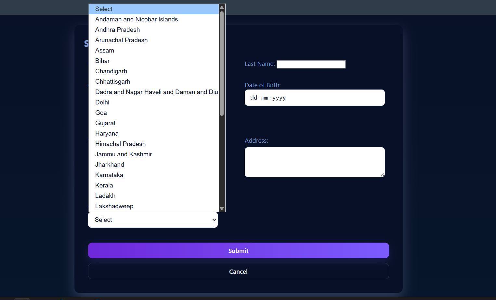
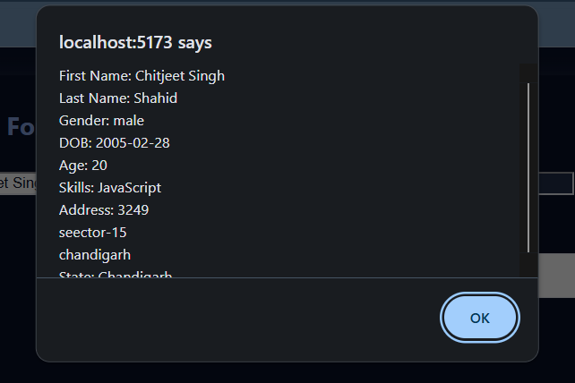

# Alert Form Experiment 

This repository holds a simple React experiment created with the Vite starter template.  The goal was to build a form component that collects user information, computes an age, and displays the data in an alert box.  Along the way we enhanced the visual presentation with custom CSS.

## Features

1. **Collects user input** – first name, last name, gender (radio buttons), date of birth, skills (checkboxes), address, and state (drop‑down).
2. **Cancel / Reset** – the _Cancel_ button clears every field back to its initial value.
3. **Submit** – the _Submit_ button prevents the normal form submission, calculates the user’s age from the date of birth, and pops up a browser `alert` showing all collected values and the derived age.
4. **Styling** – inputs are kept white against a light background for readability, the form is centered horizontally on the page, and there is padding around form rows to avoid fields touching container edges.  Basic dark‑mode support keeps the form usable at night while preserving white input fields per the assignment.

## Methodology

- **React component** – `src/App.jsx` contains the entire form as a controlled component using `useState` for form data.  Event handlers update state and handle submission logic.  A helper function computes age from the DOB.
- **Styling** – `src/App.css` received multiple updates:
  - Layout rules center the container and provide a gradient background.
  - Form rows have internal padding; inputs use `box-sizing: border-box`.
  - Colors were chosen to ensure good contrast (dark grey text on white fields) and a vibrant submit button gradient.
  - Dark‑mode tweaks keep the page usable while leaving textboxes white as requested.
- **Vite config** – the project uses the default Vite setup with React plugin, enabling hot module replacement during development.

### Form UI

### Form UI -2 

### Alert
