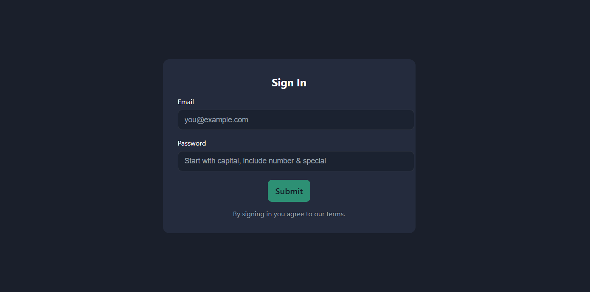
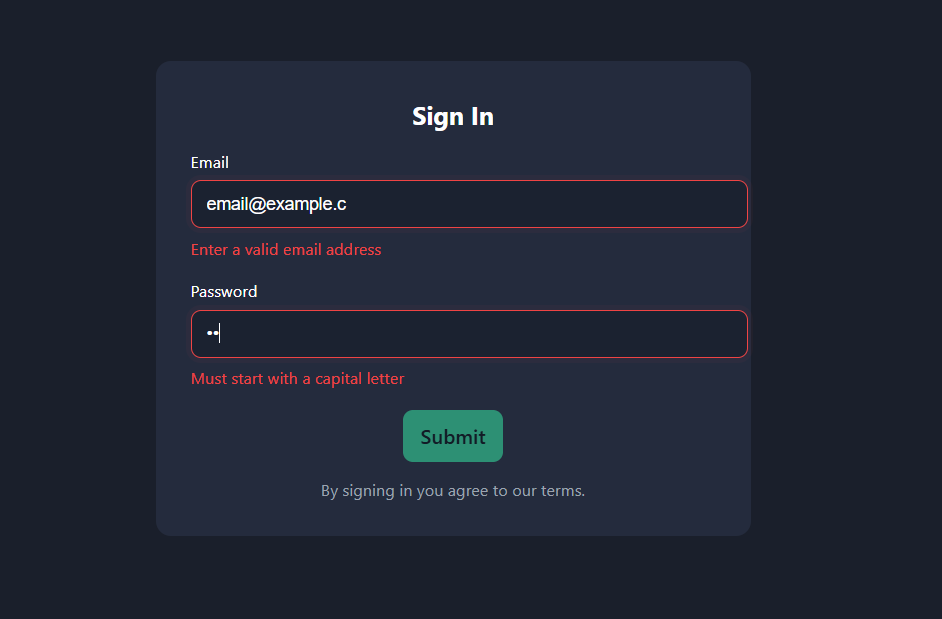

## Sign In - Validation Form

A minimal Sign In form built with React and Vite. The app demonstrates live, client-side validation for the two required fields: Email and Password, and a clean dark UI.

## What it is

- A single-page UI that displays a centered Sign In card on a solid dark background.
- Live validation shows inline errors as the user types; the Submit button is disabled until both fields are valid.

## Features

- Email validation using a strict regular expression: requires an `@` sign and a valid domain (e.g. `local@domain.tld`, TLD ≥ 2 letters).
- Password validation rules:
	- Starts with a capital letter
	- Contains at least one number
	- Contains at least one special character
	- Minimum length of 5 characters
- Accessible labels and `aria-invalid` on inputs.
- Simple, modern dark UI with a neon-green submit button and muted-red error state.

### Landing Page

### Valid Credentials

### Invalid Credentials

