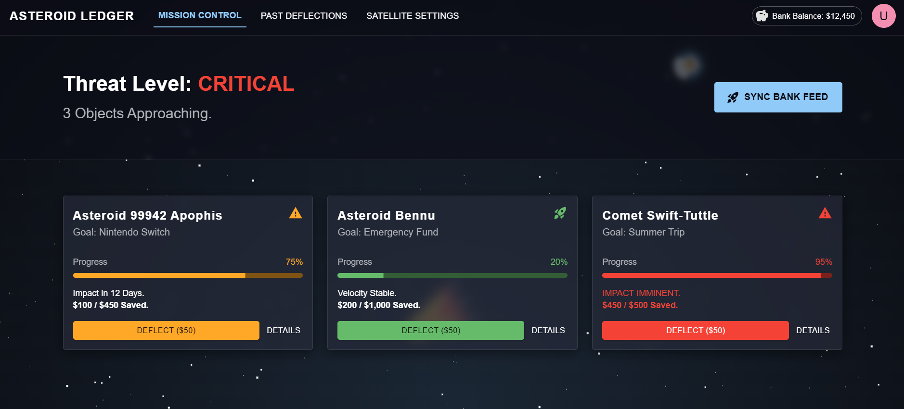

## The Asteroid Ledger

"The Asteroid Ledger" is a financial utility app that transforms the mundane task of saving money into a planetary defense mission. It uses the metaphor of "deflecting asteroids" to represent completing real-life financial goals.

## Project Overview

This innovative application gamifies the personal finance experience by connecting real NASA asteroid data with individual savings objectives. Users engage in a unique experience where their financial goals become literal missions to protect Earth from incoming asteroids.

## How It Works

### Gamification
Each active savings goal (e.g., "New Laptop") is assigned to a real asteroid based on NASA data. This creates an engaging and immersive experience where personal finance feels like a space exploration adventure.

### Tracking
The asteroid's "distance" represents the remaining amount needed to reach the savings goal. As users monitor their savings progress, they watch as their target asteroid moves closer to or further from Earth based on their account balance.

### Action
As the user adds money to their savings, the app visualizes this as "deflecting" the asteroid away from Earth. Every deposit becomes a tangible action that contributes to planetary defense, making savings feel rewarding and impactful.

## Tech Stack Highlights

### Frontend Architecture
- React.js: SPA (Single Page Application) architecture for smooth, responsive user experience
- Bootstrap: Responsive layout management and mobile-first design principles
- Material UI: Pre-built, polished components for consistent and professional UI/UX

### Additional Technologies
- Real-time data integration with NASA asteroid database
- Interactive visualization for asteroid tracking and financial metrics
- Responsive web design for desktop and mobile devices

## Project Features

- 🚀 Real-time asteroid tracking with NASA data
- 💰 Multiple savings goal management
- 📊 Visual progress indicators
- 🎮 Gamified saving experience
- 📱 Responsive design across all devices

## Project Image

